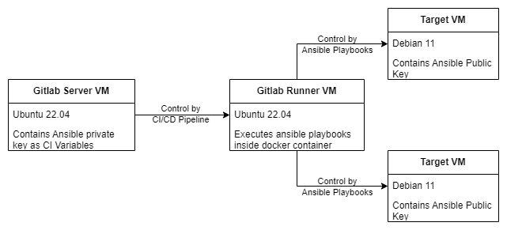

# Integrate OpenSCAP with GitOps.

## Description
This is a Git repository to automate the integration of OpenSCAP with Ansible and GitLab CI/CD for the following infrastructure: 

## Stages
 The pipeline is specfied in the [.gitlab-ci.yml](.gitlab-ci.yml) file and it is composed of three stages that can be run manually
- **oscap**: Build OpenSCAP from source and store it in another Git repository on the same GitLab server. The script for this stage is stored and documented in [build_dependencies/oscap.yml](build_dependencies/oscap.yml).
- **ssg**: Build SCAP security guide and store it in another Git repository on the same GitLab server. The script for this stage is stored and documented in [build_dependencies/ssg.yml](build_dependencies/ssg.yml).
- **scan**: Execute the ansible playbook [playbooks/scan_compliance.yml](playbooks/scan_compliance.yml) to install OpenSCAP on the target server and perform security compliance scan . 

## Usage
Upload the content of this repository to a GitLab project and create the following secret variables:
- `ANSIBLE_CFG`: (type: File) is the content of the Ansible configuration file. Example:
    ```
    [defaults]
    remote_user = vagrant
    host_key_checking = False
    strategy=free
    ```
    - `remote_user` specify the user ansible will use to access the target machines. The target machines should be preconfigured with the public ssh key for this user.
    - `host_key_checking` is set to false to ignore prompt for known hosts
    - `strategy` is set to free to allow target machines to finish their tasks without waiting for each other.

- `ANSIBLE_INVENTORY`: (type: File) is the content of the Ansible inventory file. This file should be stored as a secret variable in the GitLab project. Example:
    ```
    10.0.0.11
    10.0.0.12
    10.0.0.13
    ```


- `SSH_PRIVATE_KEY` (type: File) is the private key for the user specified in the Ansible configuration file. This key should also be stored as a secret variable.

- This project use the same GitLab server to store the OpenSCAP and SCAP security guide repositories after building them. To replicate this, create two repositories `oscap` and `ssg` on your GitLab server, create access token for them and stored as GitLab secret variables `OSCAP_ACCESS_TOKEN` (type: ENV_VAR) and `SSG_ACCESS_TOKEN` (type: ENV_VAR) respectively. 
  
## Note
- The pipeline will run only when OpenSCAP and SCAP security guide are updated to their latest version. If a newer version is detected, the `oscap` or `ssg` stage will need to be run again to update them.

- If a different method is used to store these tools, the steps of storing and retrieving them in [oscap.yml](build_dependencies/oscap.yml), [ssg.yml](build_dependencies/ssg.yml), and [.gitlab-ci.yml](.gitlab-ci.yml) should be modified accordingly.